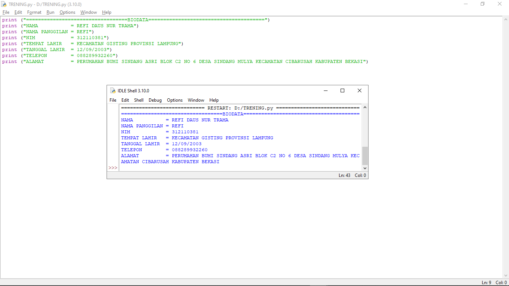
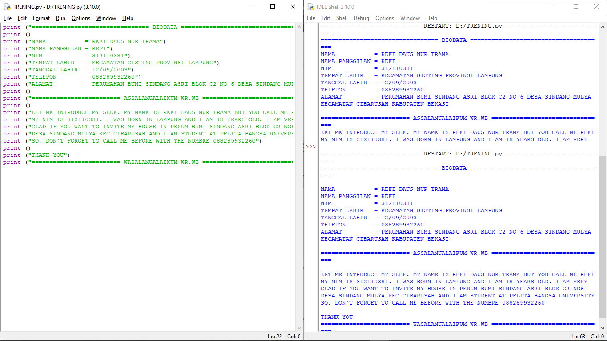

 #langkah langkah membuat biodata

 Bukalah Visual Code atau Idle Python yang sudah anda Download dan Install

'
' ikuti langkah langkah yang ada di gambar

'
' Berikut contoh kode program biodata disertai kalimat
